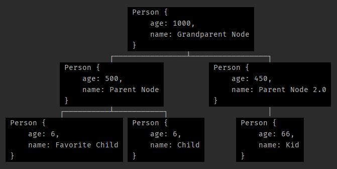
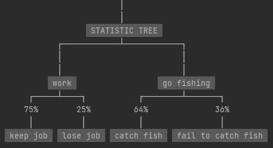
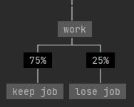

# PrettyPrintTree

This package allows you to print the tree datastructure in a readable fashion (in Python).

It supports trees with any kind of data (as long it can be turned into a string).

And even supports multi lined nodes (as in strings with \n).


# Supported Python Version

Python 3.7 and up

# Install

```bash
pip install PrettyPrintTree
```


# Import

```python
from PrettyPrint import PrettyPrintTree
```


# Documentation

I tried to make this as flexible as possible, so in order to support multiple types of trees
you need to explain to the program how to print your tree. The way to accomplish this is by passing 2 lambdas (or any other Callable):
1)  get_children: Given a node of your tree type returns an iterable of all its children (from left to right).
    For example if this is your tree implementation:
    ```python
    class Tree:
        def __init__(self, val):
            self.val = val
            self.children = []
    ```
    Then get_children would be as simple as: 
    ```python
    lambda node: node.children
    ```
    Or if your tree implementation is:
    ```python
    class Tree:
        def __init__(self, val):
            self.val = val
            self.child_right = None
            self.child_left = None
    ```
    Then get_children would be: 
    ```python
    lambda node: [node.child_left, node.child_right]
    ```

2)  get_value: Given a node of your tree type returns that node's value
    for example if your tree implementation is:
    ```python
    class Tree:
        def __init__(self, val):
            self.val = val
    ```
    then get_value would be: 
    ```python
    lambda node: node.val
    ```
    (if the value of the tree doesn't implement \_\_str\_\_ get_value should turn it into a string)


In order to print the tree you first need to make a PrettyPrintTree object which you pass your lambdas (and any other settings) to,
then you can call it whenever you want without needing to pass the lambdas each time.


## Examples

```python
from PrettyPrint import PrettyPrintTree


class Tree:
    def __init__(self, value):
        self.val = value
        self.children = []

    def add_child(self, child):
        self.children.append(child)
        return child


pt = PrettyPrintTree(lambda x: x.children, lambda x: x.val)
tree = Tree(1)
child1 = tree.add_child(Tree(2))
child2 = tree.add_child(Tree(3))
child1.add_child(Tree(4))
child1.add_child(Tree(5))
child1.add_child(Tree(6))
child2.add_child(Tree(7))
pt(tree)
```


# Other Settings


## Horizontal
You can print trees from left to right (instead of up to down)
```python
pt = PrettyPrintTree(
    lambda x: x.children, 
    lambda x: x.val, 
    default_orientation=PrettyPrintTree.HORIZONTAL
)
```
or 
```python
pt(node, orientation=PrettyPrintTree.HORIZONTAL)
```


## Trim
Say you only want to print the first few characters of each node (in order to keep the tree small for readability),
then you can set trim to a specific amount of characters.

```python
pt = PrettyPrintTree(lambda x: x.children, lambda x: x.val, trim=5)
```


## Return Instead of Print
Instead of printing the tree it can return the string instead if you prefer.

```python
to_str = PrettyPrintTree(lambda x: x.children, lambda x: x.val, return_instead_of_print=True)
tree_as_str = to_str(tree)
```


## Color
You can change the bg color of each node, or even just not use color.

```python
from colorama import Back

# change color to black:
pt = PrettyPrintTree(lambda x: x.children, lambda x: x.val, color=Back.BLACK)
```

```python
# without any color:
pt = PrettyPrintTree(lambda x: x.children, lambda x: x.val, color=None)
```


## Border
You can also surround each node with a little border:
```python
pt = PrettyPrintTree(lambda x: x.children, lambda x: x.val, border=True)
```


## Escape NewLines
You can escape \n so that each node will be printed on one line.

Note: \\n will be escaped into \\\\n so that you can tell the difference
```python
pt = PrettyPrintTree(lambda x: x.children, lambda x: x.val, show_newline_literal=True)
```


## Max Depth
You can specify a max depth so that it will only print nodes up to that depth.
This can be done either at the start:
```python
pt = PrettyPrintTree(lambda x: x.children, lambda x: x.val, max_depth=10)
```
Or when calling the function:
```python
pt(tree, max_depth=5)
```
This will override the max depth set at the start (if any) for this time only.
To have no max depth, you can set it to -1.


## Start Message
You can give a lambda that will be given the tree and will return a string which will be printed before the tree.
```python
pt = PrettyPrintTree(
    lambda x: x.children, 
    lambda x: x.val, 
    start_message=lambda node: f'printing tree of type {node.typ}'
)
```


## Dictionaries \ JSON

Printing JSON is also an option.
Although it needs to be turned into dict \ list \ tuple first
 
```python
some_json = {'foo': 1, 'bar': ('a', 'b'), 'qux': {'foo': 1, 'bar': ['a', 'b']}}
pt = PrettyPrintTree()
# either:
pt(some_json)
# or:
pt.print_json(some_json, name="DICT", max_depth=10)
```


## Labels

You can also label the branches in your tree.

The label lambda should return a string indicating the label between the node and its parent, if there should be no label then None or False.

NOTE: Currently this only works on vertical trees

NOTE: Each label must be on a single line (no \n)

```python
pt = PrettyPrintTree(
    lambda x: x.children, 
    lambda x: x.val, 
    lambda x: x.label
)
```


You can even color the labels using label_color

```python
from colorama import Back

pt = PrettyPrintTree(
    lambda x: x.children, 
    lambda x: x.val, 
    lambda x: x.label,
    label_color=Back.BLACK
)
```


# Advanced Examples

## Filtering

To filter specific nodes all you need to do is add a filter in the get_children lambda, eg:
```python
PrettyPrintTree(lambda node: filter(lambda n: "to print" in str(n.val), node.children), ...
```
```python
PrettyPrintTree(lambda node: [n for n in node.children if n.val > 3.141], ...
```

# C#

I made a C# version too:
https://github.com/AharonSambol/PrettyPrintTreeCSharp


# Java

I made a Java version too:
https://github.com/AharonSambol/PrettyPrintTreeJava