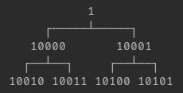
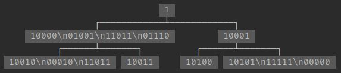
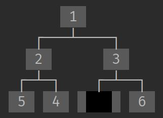

# PrettyPrintTree

This package allows you to print **trees** (the datastructure) and **linked-lists** in a readable fashion.
<br>
It supports trees with any kind of data, as long it can be turned into a string.
<br>
And even supports multi-lined nodes (strings with \n).


# Table Of Contents
- [Requirements](#requirements)
- [Install](#install)
- [Import](#import)
- [Documentation](#documentation)
- [Example](#example)
  - [Tree](#tree)
  - [Linked List](#linked-list)
- [Other Settings](#other-settings)
  - [Horizontal](#horizontal)
  - [Trim](#trim)
  - [Return Instead of Print](#return-instead-of-print)
  - [Color](#color)
  - [Border](#border)
  - [Escape NewLines](#escape-newlines)
  - [Max Depth](#max-depth)
  - [Start Message](#start-message)
  - [Dictionaries \\ JSON](#dictionaries--json)
  - [Labels](#labels)
- [Advanced Examples](#advanced-examples)
    - [Binary Tree](#binary-tree)
  - [Filtering](#filtering)
- [C#](#c)
- [Java](#java)

# Requirements
Python 3.7 and up

# Install
You can easily install **PrettyPrintTree** via **pip**:

```bash
pip install PrettyPrintTree
```


# Import
Once installed, you can import it in your Python script:

```python
from PrettyPrint import PrettyPrintTree
```


# Documentation

To ensure flexibility, PrettyPrintTree requires you to define how to print your specific tree structure. This is achieved by providing two callable functions (lambdas):

1) **get_children:** This function, given a node of your tree type, returns an iterable of all its children, from left to right.
For instance, if your tree implementation looks like this:
    ```python
    class Tree:
        def __init__(self, val):
            self.val = val
            self.children = []
    ```
    Your **get_children** function would be as simple as:
    ```python
    lambda node: node.children
    ```

2) **get_value:** Given a node of your tree type, this function should return that node's value. <br>For a tree implementation like this:

    ```python
    class Tree:
        def __init__(self, val):
            self.val = val
    ```
   
    The **get_value** function would be:

    ```python
    lambda node: node.val
    ```
    *Note: if the value of the tree doesn't implement `__str__`, the **get_value** function should convert it into a string.*

To print the tree, you first need to create a PrettyPrintTree object by providing your lambdas and any additional settings. You can then call this object whenever needed without repeatedly specifying the lambdas.

### Linked Lists
Printing a linked-list is similar, instead of **get_children** you will need: 
<br>
**get_next:** This function, given a node of your linked-list type, returns the next node.

And optionally:
<br>
**get_prev:** Given a node of your linked-list type, this function should return the previous node.


# Example
### Tree
```python
from PrettyPrint import PrettyPrintTree


class Tree:
    def __init__(self, value):
        self.val = value
        self.children = []

    def add_child(self, child):
        self.children.append(child)
        return child


pt = PrettyPrintTree(lambda x: x.children, lambda x: x.val)
tree = Tree(1)
child1 = tree.add_child(Tree(2))
child2 = tree.add_child(Tree(3))
child1.add_child(Tree(4))
child1.add_child(Tree(5))
child1.add_child(Tree(6))
child2.add_child(Tree(7))
pt(tree)
```


### Linked List
```python
from PrettyPrint import PrettyPrintLinkedList

class Node:
    def __init__(self, val):
        self.val = val
        self.next_node = None
        self.prev_node = None


n1, n2, n3, n4 = Node("Node1"), Node("Node2"), Node("Node\nJs"), Node("Node4")
n1.next_node = n2
n2.next_node = n3
n3.next_node = n4
n3.prev_node = n2
pt = PrettyPrintLinkedList(
    lambda x: x.val,
    lambda x: x.next_node,
    lambda x: x.prev_node,
    orientation=PrettyPrintLinkedList.Horizontal,
)
pt(n1)
```


# Other Settings

***These settings can either be set when initializing the `PrettyPrintTree` object or when calling the function (which will override the initial setting)***
## Horizontal
You can print trees from left to right instead of the default top-to-bottom layout:
```python
pt = PrettyPrintTree(
    lambda x: x.children, 
    lambda x: x.val, 
    orientation=PrettyPrintTree.Horizontal
)
```


## Trim
If you want to print only a limited number of characters from each node to keep the tree concise and readable, you can use the **trim** setting:

```python
pt = PrettyPrintTree(lambda x: x.children, lambda x: x.val, trim=5)
```


To use a different trim symbol instead of `...`, you can do this:

```python
pt = PrettyPrintTree(
    lambda x: x.children, lambda x: x.val, trim=5,
    trim_symbol=' ' + colorama.Back.GREEN
)
```


## Return Instead of Print

If you prefer to get the tree as a string instead of printing it directly, you can enable the **return_instead_of_print** setting:

```python
to_str = PrettyPrintTree(lambda x: x.children, lambda x: x.val, return_instead_of_print=True)
tree_as_str = to_str(tree)
```


## Color
You can change the background color of each node or opt for no color at all:

```python
from colorama import Back

pt = PrettyPrintTree(lambda x: x.children, lambda x: x.val, color=Back.BLACK)
```


For no color:

```python
pt = PrettyPrintTree(lambda x: x.children, lambda x: x.val, color='')
```



## Border
You can surround each node with a border:

```python
pt = PrettyPrintTree(lambda x: x.children, lambda x: x.val, border=True)
```


## Escape NewLines
To print each node on one line, you can escape the newline characters:

```python
pt = PrettyPrintTree(lambda x: x.children, lambda x: x.val, show_newline_literal=True)
```

<br>
In order to distinguish between \n and \\n you can highlight the \n's:

```python
PrettyPrintTree(
    lambda x: x.children, lambda x: x.val,
    show_newline_literal=True,
    newline_literal=colorama.Fore.LIGHTGREEN_EX + '\\n' + colorama.Fore.RESET
)
```


## Max Depth
Limit the depth to control how many levels of nodes are printed:

```python
pt = PrettyPrintTree(lambda x: x.children, lambda x: x.val, max_depth=10)
```
*Note: the head node has a depth of 0*


## Start Message
You can add a message to be printed before the tree. Use a lambda that receives the tree and returns a message:

```python
pt = PrettyPrintTree(
    lambda x: x.children, 
    lambda x: x.val, 
    start_message=lambda node: f'printing tree of type {node.typ}:'
)
```


## Dictionaries \ JSON

**PrettyPrintTree** can also print JSON structures, although they need to be converted into a dictionary, list, or tuple first:
 
```python
some_json = {'foo': 1, 'bar': ('a', 'b'), 'qux': {'foo': 1, 'bar': ['a', 'b']}}
pt = PrettyPrintTree()
pt.print_json(some_json, name="DICT")
```


## Labels

You can label the branches in your tree by providing a lambda that returns a label between the node and its parent. Use `None` or `False` if no label is needed:

```python
pt = PrettyPrintTree(
    lambda x: x.children, 
    lambda x: x.val, 
    lambda x: x.label
)
```


You can even apply color to the labels using **label_color**:

```python
from colorama import Back

pt = PrettyPrintTree(
    lambda x: x.children, 
    lambda x: x.val, 
    lambda x: x.label,
    label_color=Back.BLACK
)
```


# Advanced Examples

### Binary Tree
Here's how to print a binary tree:

```python
class Tree:
    def __init__(self, val):
        self.val = val
        self.right = None
        self.left = None
```
One approach is to define **get_children** as follows:

```python
PrettyPrintTree(
    lambda x: [x for x in [x.prev_node, x.next_node] if x is not None],
    lambda x: x.val
)
```


However, this approach does not preserve the direction of the children when only one child is present. For better results, use this approach:

```python
PrettyPrintTree(
    lambda x: [] if x is None or x.prev_node is x.next_node is None else [x.prev_node, x.next_node],
    lambda x: x.val if x else (colorama.Back.BLACK + '   ' + colorama.Back.LIGHTBLACK_EX)
)
```



## Filtering

You can easily filter specific nodes by adding a filter in the **get_children** lambda:

```python
PrettyPrintTree(lambda node: filter(lambda n: "to print" in str(n.val), node.children), ...
```
```python
PrettyPrintTree(lambda node: [n for n in node.children if n.val > 3.141], ...
```

# C#

A C# version of PrettyPrintTree is also available: 
https://github.com/AharonSambol/PrettyPrintTreeCSharp


# Java

A Java version of PrettyPrintTree is also available: 
https://github.com/AharonSambol/PrettyPrintTreeJava